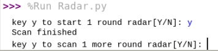

# Raspberry Pi 4 + Simple scan (Radar) by Python

This radar use Ultrasonic distance measuring SR04 and servo motor SG90 control by Raspberry Pi 4 (45 degree to 135 degree)

## The requirement 
- Pigpio -> serve control
- Matplotlib and Numpy -> create the polar chart
- RPi.GPIO -> control SR04 (Ultrasonic sensor)

  

## Wiring diagram

## Real project 
 

  

### Result

 

